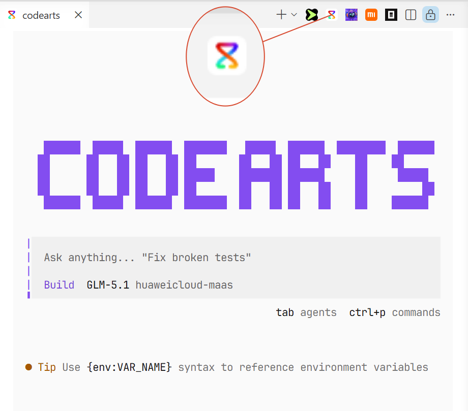

# codearts-cli-quick_start-vscode_plugin

将 [CodeArts](https://codearts.huaweicloud.com/download.html) 无缝集成到 VS Code 开发工作流中。在书签选项卡右侧工具栏中添加快速启动 CodeArts CLI 的按钮。

## 前置要求

本插件需要在系统中安装 [CodeArts CLI](https://codearts.huaweicloud.com/download.html)。

### 免登录直接启动 CLI

根据[华为云 CodeArts CLI 文档](https://support.huaweicloud.com/usermanual-cli/codeartsagent_cli_0026.html#codeartsagent_cli_0026__section1797214121314)配置环境变量，即可免登录直接启动 CLI。

## 安装方式

1. 打开 VS Code
2. 打开命令面板（`Cmd+Shift+P` / `Ctrl+Shift+P`）
3. 输入 **"Extensions: Install from VSIX..."**
4. 选择 `codearts-cli-quick-start-vscode-plugin-1.0.1.vsix` 文件

## 功能特性

- **快速启动**：使用 `Cmd+Shift+1`（Mac）/ `Ctrl+Shift+1`（Windows/Linux）在分屏终端中打开 CodeArts，若已打开则自动聚焦。
- **新建会话**：使用 `Cmd+Shift+Esc`（Mac）/ `Ctrl+Shift+Esc`（Windows/Linux）启动新的终端会话。也可点击编辑器标题栏的 CodeArts 按钮。
- **上下文感知**：自动将当前选中的代码或文件传递给 CodeArts。
- **文件引用快捷键**：使用 `Cmd+Shift+2`（Mac）/ `Ctrl+Shift+2`（Windows/Linux）插入文件引用（如 `@src/file.ts#L10-20`）。

## 命令列表

| 命令 | 说明 | 快捷键 |
|------|------|--------|
| Open CodeArts | 打开或聚焦已有终端 | `Cmd+Shift+1` / `Ctrl+Shift+1` |
| Open CodeArts in new tab | 始终打开新终端 | `Cmd+Shift+Esc` / `Ctrl+Shift+Esc` |
| Add Filepath to Terminal | 在光标处插入文件引用 | `Cmd+Shift+2` / `Ctrl+Shift+2` |

## 问题反馈

如遇到问题或有改进建议，请在 https://github.com/CyrusRune/codearts-cli-quick_start-vscode_plugin/issues 提交 issue。

## 开发指南

1. 用 VS Code 打开项目目录
2. 运行 `npm install` 安装依赖
3. 按 `F5` 启动插件调试窗口

### 修改代码

调试期间 `tsc` 和 `esbuild` 的文件监听会自动运行，代码修改后在后台重新构建。

查看修改效果：

1. 在调试窗口中打开命令面板（`Cmd+Shift+P` / `Ctrl+Shift+P`）
2. 运行 **Developer: Reload Window**

## 许可证

MIT